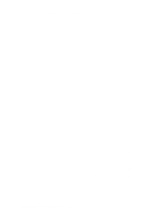

# DocuMate

DocuMate is an evidence-first trust layer for freelance and contract work on Polkadot Hub Testnet. It turns identity-gated actions, settlement, and enforcement into verifiable on-chain outcomes so disputes can be resolved from reproducible proof.

## Quick Verification

Use these commands from repo root:

1. npm run lint
2. npm run build
3. npx hardhat test
4. npm run testnet:config-check

Expected anchors include:

- Config check passed.
- split(1 PAS): 750000000000000000 200000000000000000 50000000000000000
- Marketplace and staking addresses matching this README.

## Problem

Most contract workflows still fail at trust boundaries:

- Identity claims are hard to verify at action time.
- Revenue sharing is often opaque off-chain bookkeeping.
- Breach outcomes are difficult to enforce in a durable way.

DocuMate addresses this with verification-gated actions, deterministic settlement, and slash-aware contract flows.

## Runtime Precompile Integration

DocuMateMarketplace uses the Polkadot Hub runtime identity precompile at:

- 0x0000000000000000000000000000000000000818

Evidence-backed call path in Solidity:

- identityPrecompile.staticcall(...)
- abi.encodeWithSelector(IIdentityPrecompile.identity.selector, account)

Source-backed default mode:

- useMockVerification = false

This architecture enables Solidity contracts to consume runtime-native identity capabilities through a PVM precompile, instead of relying on an external trust bridge.

For exact proof details and source references, see docs/precompile-integration.md.

## Live Network and Contract Context

- Network: Polkadot Hub Testnet
- Chain ID: 420420417
- RPC: https://eth-rpc-testnet.polkadot.io/
- Marketplace: 0x233FE6112E5Ad4Db1c83358B30D581F837314BB1
- Staking: 0x1cf190eabe490B50AaBE91b4567ebe88126e8D24

Explorer references:

- https://blockscout-testnet.polkadot.io/address/0x233FE6112E5Ad4Db1c83358B30D581F837314BB1
- https://blockscout-testnet.polkadot.io/address/0x1cf190eabe490B50AaBE91b4567ebe88126e8D24

## Validation Runbook

Run in order:

1. npm audit --omit=dev
2. npm run lint
3. npm run build
4. npx hardhat test
5. npm run testnet:config-check

Interpretation rules:

- If a command fails, the related claim is NOT VERIFIED.
- Do not infer pass status from previous runs.
- Use command output anchors in CHANGELOG.md to mark release validation status.

## Local Setup

1. npm install
2. Copy .env.example to .env and set local secrets.
3. npx prisma generate
4. npx prisma db push
5. npm run dev

## Documentation Map

- Runtime precompile proof: docs/precompile-integration.md
- Demo walkthrough and fallback path: docs/DEMO.md
- FAQ with bounded claims: docs/FAQ.md
- Product and release history: CHANGELOG.md

## Scope and Claim Boundaries

- This README only asserts behaviors that are backed by repository source or deterministic commands.
- Transaction-level outcomes should be treated as NOT VERIFIED unless explicit hashes and command outputs are captured in release evidence.

## License

MIT
