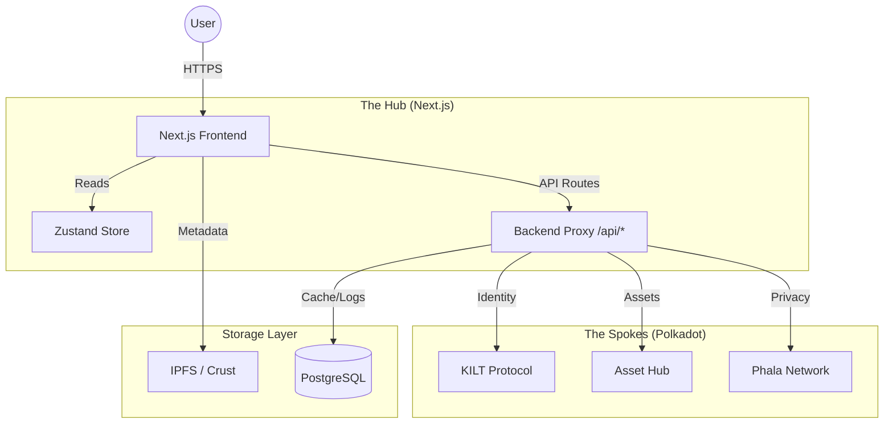

# System Architecture & Workflow Document: DocuMate

## 1. Architectural Overview

**Pattern:** Hybrid Web3 Application (Hub-and-Spoke)
**Orchestrator:** Next.js 15 (App Router)
**The "Hub":** The centralized User Interface and API Proxy.
**The "Spokes":** Specialized Parachains for Identity, Assets, and Compute.

## 2. Core Workflows

### Workflow 1: The "Zero-to-Hero" Identity Loop

**Goal:** Transform a raw Wallet Address into a Trusted Professional Profile without manual data entry.

1. **Connection:**
* User connects wallet (Polkadot.js / Talisman).
* *System Check:* Query KILT CType registry for `did:kilt:...` associated with this wallet.

2. **Identity Bootstrap (If New):**
* User clicks "Claim Identity".
* *Action:* System creates a **Light DID** (off-chain, signed by wallet).
* *Storage:* DID Document stored in local browser storage (MVP) or anchored on-chain (Production).

3. **Reputation Ingestion (The "Listener"):**
* *Trigger:* User completes a job and receives a payment with `system.remark` (POC-1 Standard).
* *Indexer:* A background service (Squid/SubQuery) scans the chain for incoming payments to the User's address containing the `POC-1` hash.
* *Logic:*
* `if (remark.type == "SmartContract")` -> **Add Tag:** "Blockchain Dev".
* `if (remark.value > $10k)` -> **Add Badge:** "High Value Pro".

4. **Profile Rendering:**
* The `ProfilePage` fetches this aggregated data to display the dynamic "Work History" timeline.

### Workflow 2: The Marketplace "Flywheel" (75/20/5 Split)

**Goal:** Execute a trustless asset sale with an immediate revenue split.

1. **Minting (The Creator):**
* Creator uploads Template (PDF/Markdown) in `Studio`.
* **Step A (Storage):** File is encrypted client-side. Encrypted blob uploaded to IPFS. `CID` returned.
* **Step B (Minting):** Creator signs transaction on **Asset Hub**.
* `create_asset(collection_id, metadata: { ipfs: CID, royalty: 75 })`.

2. **Purchasing (The Buyer):**
* Buyer clicks "Buy License" ($100 DOCU).
* **Step A (Smart Contract Execution):**
* Contract calls `transfer(Buyer -> Contract, 100)`.
* **Split Logic:**
* `transfer(Contract -> Creator, 75)`
* `transfer(Contract -> CompanyTreasury, 20)`
* `burn(5)` (Send to `0x00...00`)

* **Step B (Asset Delivery):**
* Contract transfers NFT ownership to Buyer.
* *Access Control:* The system releases the **Decryption Key** to the Buyer (gated by NFT ownership check).

### Workflow 3: Privacy-First AI Drafting (SaaS)

**Goal:** Provide "Secret" AI drafting where the prompt never hits a public server in plain text.

1. **Input:** User types: *"Draft an NDA for [Client: Apple]"*.
2. **Encryption (Client-Side):**
* Browser fetches Phala Worker's **Public Key**.
* Encrypts prompt: `E(Key, "Draft NDA for Apple")`.

3. **Transport:**
* Next.js sends ciphertext to `/api/phala-proxy`.

4. **Secure Execution (TEE):**
* Phala Worker receives ciphertext.
* **Inside TEE (The Black Box):**
* Decrypts prompt.
* Runs LLM (Llama 3 8B).
* Generates: *"This Non-Disclosure Agreement..."*
* Encrypts response: `E(UserPublicKey, Response)`.

5. **Delivery:**
* Next.js receives encrypted response.
* Browser decrypts and renders text in the editor.

### Workflow 4: The "Blue Check" Verification

**Goal:** Monetize trust via a manual audit loop.

1. **Submission:** Creator submits Template ID + $50 Payment TX.
2. **Admin Queue:**
* Data lands in `PostgreSQL` (Table: `VerificationRequests`).
* Status: `PENDING`.

3. **Audit:**
* Admin reviews content.
* *Decision:* **APPROVE**.

4. **Issuance (KILT):**
* Admin triggers `Kilt.credential.issue()`.
* Credential: `VerifiedTemplateCredential`.
* Subject: `TemplateDID`.

5. **On-Chain Update:**
* Admin updates the NFT Metadata (via mutable field) to include `verified: true` or attaches the KILT Credential hash.

## 3. Data Flow & State Management

### 3.1. Where does data live?

| Data Type | Storage Location | Privacy Level | Persistence |
| --- | --- | --- | --- |
| **User Profile** | KILT (DID) + Indexer | Public | Immutable |
| **Contract History** | Polkadot Chain (`system.remark`) | Public | Immutable |
| **Template Content** | IPFS | **Private (Encrypted)** | Permanent |
| **Template Metadata** | Asset Hub (NFT) | Public | Immutable |
| **Draft Documents** | LocalStorage / PostgreSQL | Private | Session/User |
| **Admin Logs** | PostgreSQL | Private (Company) | Permanent |

### 3.2. Integration Points

* **Next.js <-> Polkadot:** Uses `@polkadot/api` via WebSocket (`wss://westend-asset-hub...`).
* **Next.js <-> Phala:** Uses HTTP/gRPC bridge to Phala Phat Contracts.
* **Next.js <-> Postgres:** Uses Prisma/Drizzle ORM for off-chain user settings (e.g., "Dark Mode", "Subscription Tier").

## 4. Sequence Diagram: The "Job" Lifecycle

This flow illustrates how **Reputation** is built.

1. **Client** and **Freelancer** agree on terms in **DocuWriter**.
2. **DocuWriter** generates a hash of the PDF: `0xABC...`
3. **Client** initiates payment of 1000 USDT on Asset Hub.
* *Attach Memo:* `POC1:0xABC...:Type=ReactDev`

4. **Blockchain** finalizes block.
5. **DocuMate Indexer** detects the memo.
6. **DocuMate Indexer** updates the Freelancer's "Cached Profile":
* `TotalEarnings += 1000`
* `Contracts += 1`
* `Tags.push("ReactDev")`

7. **Freelancer** logs in next time -> Profile shows updated stats automatically.

## 5. Security Architecture

* **Wallet-Based Auth:** No passwords. `SIWE` (Sign-In with Ethereum) or Polkadot equivalent is used to authenticate sessions for the SaaS features.
* **TEE Guarantee:** We guarantee privacy because we *cannot* see the user's AI prompts even if we wanted to. The Phala hardware enforcing the encryption prevents operator access.
* **Revenue Enforcement:** The 20% fee is hard-coded in the Smart Contract. Even the Admin cannot bypass this for specific users without upgrading the entire contract code.